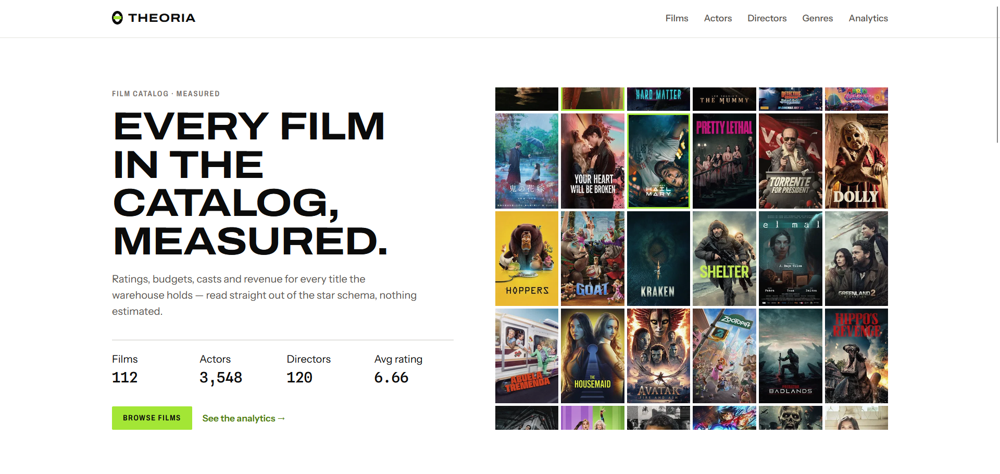
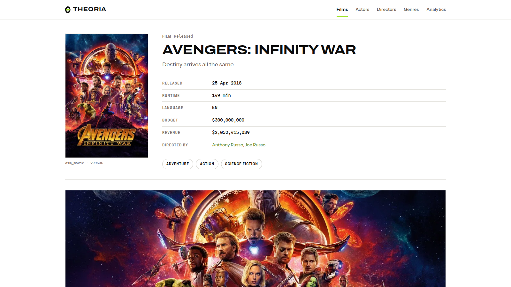
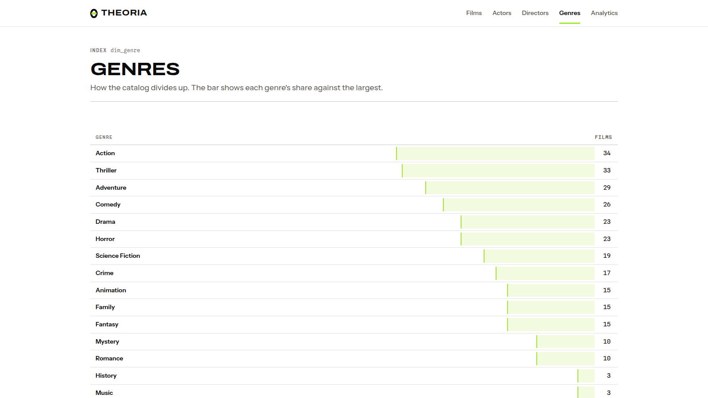

# Theoria

A movie analytics platform (mini IMDb + analytics) built to learn real Data Engineering:

```
TMDB API → S3 Data Lake (Bronze/Silver/Gold) → PostgreSQL warehouse (star schema) → Django UI
```

Full design rationale: [`docs/architecture.md`](docs/architecture.md). Task-by-task roadmap and
rules: [`CLAUDE.md`](CLAUDE.md). Running learning log: [`for_learning.md`](for_learning.md).

## Screenshots

| Home | Analytics dashboard |
|---|---|
|  |  |

| Film catalog | Film detail |
|---|---|
|  |  |

| Genres |
|---|
|  |

## Prerequisites

- Python 3.11+
- An AWS account with an S3 bucket (data lake)
- A PostgreSQL server (the warehouse) and a database created for it, e.g. `theoria`
- A [TMDB](https://www.themoviedb.org/settings/api) API key (v3 auth)

## 1. Setup

```bash
python -m venv venv && source venv/bin/activate
pip install -r requirements.txt
cp .env.example .env              # then fill in real values (API key, AWS creds, DATABASE_URL, ...)
python -c "import config"         # verify env is set up — fails loud listing every missing var
pytest                            # run the full test suite (no network/DB required — see below)
```

`config.py` is the single source of truth for all configuration — every script reads secrets and
paths through it, never hardcoded.

## 2. Create the warehouse schema

With `DATABASE_URL` pointing at an empty database, apply the three bootstrap files in order.
Together they build the **current** schema: 5 dimensions (`dim_movie`, `dim_person`,
`dim_collection`, `dim_genre`, `dim_date`), 3 facts (`fact_movie_metrics`, `fact_credit`,
`fact_collaboration`) and `etl_watermarks`. All are `IF NOT EXISTS`, so re-running is safe.

```bash
psql "$DATABASE_URL_WITHOUT_DRIVER_PREFIX" -f warehouse/ddl/01_dimensions.sql
psql "$DATABASE_URL_WITHOUT_DRIVER_PREFIX" -f warehouse/ddl/02_facts.sql
psql "$DATABASE_URL_WITHOUT_DRIVER_PREFIX" -f warehouse/ddl/03_watermark.sql
```

**Do not run `04`–`11` on a fresh database.** They are the historical migrations that brought an
already-live warehouse to this shape, and they are only correct applied in order to a database
that predates them — `11_drop_legacy_person_tables.sql` drops tables that `01` no longer creates.
They are kept in the repo as the record of how the schema got here. If you are migrating an
existing Theoria warehouse rather than building a new one, apply them in numeric order instead.

The `slug` columns are declared by `01_dimensions.sql` but left empty; the slugs themselves are
populated by `load_dimensions()` (see below).

(`DATABASE_URL` in `.env` uses the SQLAlchemy `postgresql+psycopg2://...` form; strip the
`+psycopg2` driver suffix when passing the URL to plain `psql`.)

## 3. Run the pipeline

The whole ETL — Bronze ingest → Silver transform → Gold aggregate → warehouse load — is chained
by a single script:

```bash
python -m scripts.run_pipeline --date 2026-07-06 --max-pages 5
```

By default the catalogue comes from TMDB's `movie/popular` list, which only ever returns what is
popular *right now* — so the resulting corpus skews heavily to the last few years. To build a
historical catalogue instead, use the `discover` source, which fetches the most-voted films of
each release year over the configured `DISCOVER_*` range in `.env`:

```bash
python -m scripts.run_pipeline --source discover
```

This calls, in order, for the given `ingestion_date`:

1. **Bronze** — `ingest_genres`, then either `ingest_movies` (paginated, `max_pages` pages) or
   `ingest_discover` (year-partitioned), then `ingest_movie_details` + `ingest_credits` for every
   movie ID discovered.
2. **Silver** — `transform_movies`, `transform_people`, `transform_genres`,
   `transform_credits_bridge`, followed by `run_silver_checks` (data quality gate; bad rows are
   quarantined to `data_quality/rejected/`, never dropped).
3. **Gold** — `build_gold_datasets` (genre metrics, decade stats, actor filmography, director
   ratings).
4. **Warehouse** — `load_dimensions` then `load_facts` (upsert via `ON CONFLICT DO UPDATE`,
   safe to re-run for the same date), followed by `run_warehouse_checks` (FK integrity +
   row-count sanity across every layer).

Every stage logs record counts and duration; the script ends with a one-line run summary.
Re-running for the same `--date` is safe — every stage is idempotent.

To load only *new* partitions found in S3 without re-specifying dates:

```bash
python -m etl.warehouse_loader.load_dimensions --incremental
python -m etl.warehouse_loader.load_facts --incremental
```

## 4. Run the Django UI

```bash
cd django_app
python manage.py runserver
```

Pages: `/` (home stats), `/movies/<slug>/`, `/people/<slug>/`, `/genres/<id>/`, and `/analytics/`
(9-panel dashboard built on the SQL in `warehouse/queries/`).

`/people/` is the single index of everyone holding any credit; `/actors/` and `/directors/` are
scopes of it (people with an Acting or a Directing credit) rather than separate tables. Legacy
`/actors/<slug>/` and `/directors/<slug>/` URLs 301 to `/people/<slug>/` where the slug still
resolves.

Movies and people are addressed by a URL slug (e.g. `/people/tom-hanks/`) rather than their
warehouse surrogate key — see `dim_*.slug` and `assign_slugs()` in `load_dimensions.py`.
Genres are few enough (~19) that collisions aren't a concern, so they're still addressed by id.

Django never writes to the warehouse — models are `managed = False` and a custom router
(`core/routers.py`) blocks migrations against it. Django's own auth/session tables live in a
separate local SQLite database.

## Tests

```bash
pytest
```

The full suite (210 tests) runs against mocked S3/TMDB/Postgres boundaries only — no network
access or live database is required. It covers ETL transforms, data quality checks, warehouse
loaders, and Django views.

## Project layout

See the tree in [`CLAUDE.md`](CLAUDE.md#project-structure) for the full annotated directory
layout, and [`docs/architecture.md`](docs/architecture.md) for the schema and data-flow design.
