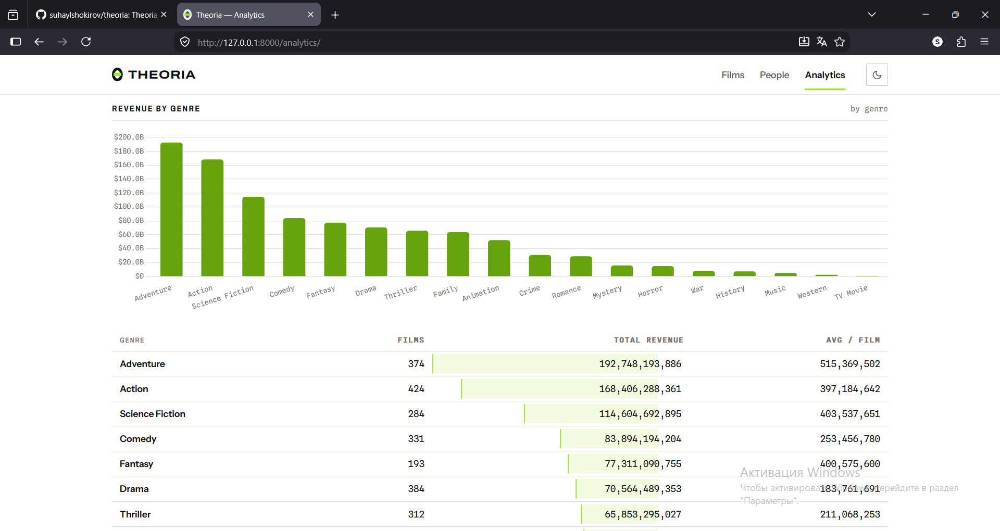
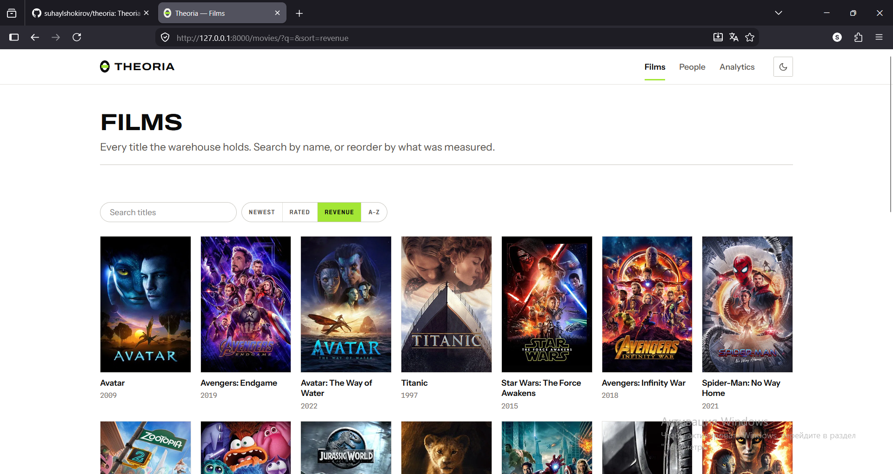

# Theoria

**A film analytics platform built on a real data engineering stack** — TMDB ingestion, a
three-layer S3 data lake, a dimensional PostgreSQL warehouse, and a Django front end that reads
it. Every layer is idempotent, quality-gated, and rebuildable from immutable raw data.

```
TMDB API  →  Bronze (raw JSON)  →  Silver (typed Parquet)  →  Gold (aggregates)  →  PostgreSQL  →  Django
                        S3 data lake, partitioned by ingestion_date                  star schema
```

<sub>Python 3.11 · PostgreSQL · AWS S3 · Django 5.1 · pandas · SQLAlchemy · pytest</sub>

---

## The warehouse, as it stands

| | |
|---|---|
| Films | **1,215** spanning 1930–2026 |
| Credited people | **123,405** — every person in every department, not just cast and directors |
| Credits | **239,089** across 13 departments and 858 distinct job titles |
| Collaboration edges | **194,372** repeat working relationships, derived in Gold |
| Film series | **365** |
| Ratings | IMDb and TMDB, **1,211 / 1,215** films carry an IMDb score |
| Warehouse tables | **16** — 8 dimensions, 4 facts, 3 bridges, 1 operational |
| Test suite | **298** tests, no network or live database required |

The corpus is deliberate rather than incidental. TMDB's `movie/popular` endpoint returns whatever
is trending at call time, which produced a catalog that was 69% films from the 2020s. Switching
extraction to `discover/movie`, windowed one release year at a time, rebuilt it as an even
~200 films per decade — a time axis no downstream transform could have recovered had the
extraction step never collected it.

## Screenshots

| Home | Analytics |
|---|---|
|  |  |

| Film catalog | Film detail |
|---|---|
|  |  |

---

## Architecture

### The three lake layers

| Layer | Format | Contract |
|---|---|---|
| **Bronze** | Raw JSON, one file per API response | Immutable and append-only. Never edited, never overwritten. It is the system of record every other layer can be rebuilt from. |
| **Silver** | Typed Parquet | Owns correctness — flattening, type casting, deduplication at the true grain. Bad rows are **quarantined**, never silently dropped. |
| **Gold** | Aggregated Parquet | Pre-computed analytical datasets, including the collaboration graph loaded into the warehouse. |

Everything is partitioned by `ingestion_date=YYYY-MM-DD`. That single convention is what makes
re-runs idempotent and incremental loads possible: a partition is a unit of work that can be
reprocessed in isolation without touching anything else.

### The star schema

```
        dim_genre   dim_date   dim_collection   dim_company   dim_country   dim_language
            │          │             │              │             │             │
            └────┬─────┘             │              ▼             ▼             ▼
                 ▼                   ▼      bridge_movie_company  bridge_movie_country
 dim_person ─► fact_credit ─► dim_movie ◄─ fact_movie_metrics    bridge_movie_language
      │                          ▲         (revenue, budget,             │
      ├──► fact_collaboration    └── fact_movie_rating ◄────────────────┘
      │    (derived in Gold)         (imdb / tmdb — the rating of record)
```

**Dimensions** — `dim_movie`, `dim_person`, `dim_genre`, `dim_collection`, `dim_date`,
`dim_company`, `dim_country`, `dim_language`
**Facts** — `fact_movie_metrics`, `fact_credit`, `fact_collaboration`, `fact_movie_rating`
**Bridges** — `bridge_movie_company` (Phase 13), `bridge_movie_country`, `bridge_movie_language`
(Phase 14). Factless join tables — no measure, just the existence of a relationship — named
`bridge_` rather than `fact_` to keep that distinction visible in the schema itself. They are the
warehouse's first genuine many-to-many relationships: a film has 2.81 production companies on
average and is produced in / spoken in several countries and languages, unlike `dim_collection`
(one collection per film, so *that* relationship fits as a plain column on `dim_movie`).
`bridge_movie_country` carries `relation ∈ {origin, production}` in its primary key, because the
two disagree on ~23% of films and a coarser key would let one overwrite the other.
**Operational** — `etl_watermarks`

Two grain decisions carry most of the weight:

- **`fact_credit` is keyed `(movie_id, person_id, department, job)`** — the grain TMDB actually
  publishes. A director who also wrote and produced is three credits, not one. Getting this wrong
  earlier in the project silently destroyed the "Director" row for 65 of 99 films, because those
  people were usually credited as producers too and the dedup key couldn't tell the jobs apart.
- **`fact_movie_metrics` is keyed `(movie_id, date_id, genre_id)`**, so a multi-genre film repeats
  its movie-level measures once per genre. Every query that aggregates `revenue` or `popularity`
  off it must collapse it with `SELECT DISTINCT movie_id, …` first. Ratings used to live here too
  and carried the same tax; **Phase 15 moved them to `fact_movie_rating`**, keyed `(movie_id,
  source)` — one row per film per source (IMDb from a daily bulk file, TMDB from the movie
  payload), so `AVG(rating)` needs no de-duplication and IMDb's mark is what the site shows.

### Data quality as a gate, not a report

Two check suites run as part of the pipeline, both exiting non-zero on failure:

- **`data_quality/silver_checks.py`** — schema, null, uniqueness and range checks per Silver
  entity. Offending rows are tagged with a `rejection_reason` and written to
  `data_quality/rejected/`, so a failure is investigable rather than just counted.
- **`data_quality/warehouse_checks.py`** — foreign-key anti-joins across every fact→dimension
  relationship, plus row-count reconciliation Bronze → Silver → Gold → warehouse.

A lesson the project paid for: a check written by mirroring the transform's assumptions confirms
bugs instead of catching them. Check configs are now written from the source payload shape.

### Reading the warehouse from Django

Read-only access is enforced at three independent levels: a database router that refuses
migrations against the warehouse, `managed = False` on every model, and a separate SQLite database
for Django's own auth and session tables. The analytics dashboard executes the `.sql` files in
`warehouse/queries/` directly rather than re-expressing them through the ORM, so the queries stay
reviewable as SQL.

Full decision log, with the alternatives considered and the measurements behind each choice:
[`docs/architecture.md`](docs/architecture.md).

---

## Getting started

### Prerequisites

- Python 3.11+
- An S3 bucket for the data lake
- A PostgreSQL server with an empty database (e.g. `theoria`)
- A [TMDB API key](https://www.themoviedb.org/settings/api) (v3 auth)

### 1. Install and configure

```bash
python -m venv venv && source venv/bin/activate
pip install -r requirements-etl.txt   # superset: web runtime + pipeline + tests
cp .env.example .env              # fill in API key, AWS credentials, DATABASE_URL
python -c "import config"         # fails loud, listing every missing variable at once
python -c "import config; config.require_etl()"   # same, for the pipeline's own set
pytest                            # full suite; no network or database needed
```

`config.py` is the only place that reads the environment. No script hardcodes a key, path or URL.

**Two requirements files, on purpose.** `requirements.txt` holds only what the web site runs on
(Django, psycopg2, python-dotenv); `requirements-etl.txt` includes it and adds pandas, pyarrow,
boto3, SQLAlchemy and pytest. The hosted function installs the small one, so the ETL stack — an
order of magnitude larger, and never imported by a view — stays out of a bundle with a hard size
limit. Locally you want `requirements-etl.txt`.

Which variables are required depends on what you are running: `DATABASE_URL` always,
`DJANGO_SECRET_KEY` for the site, and `TMDB_API_KEY`/`AWS_*`/`S3_BUCKET` for the pipeline. A
missing one still stops the process before it does any work — it is just the right process now.

### 2. Create the warehouse schema

Apply the three bootstrap files in order against an empty database. Together they build the
**current** 16-table schema; all statements are `IF NOT EXISTS`, so re-running is safe.

```bash
psql "$DATABASE_URL_WITHOUT_DRIVER_PREFIX" -f warehouse/ddl/01_dimensions.sql
psql "$DATABASE_URL_WITHOUT_DRIVER_PREFIX" -f warehouse/ddl/02_facts.sql
psql "$DATABASE_URL_WITHOUT_DRIVER_PREFIX" -f warehouse/ddl/03_watermark.sql
```

> **Do not run `04`–`15` on a fresh database.** Those are the historical migrations that brought an
> already-live warehouse to this shape, and they are only correct applied in order to a database
> that predates them — `11_drop_legacy_person_tables.sql` drops tables `01` no longer creates. Once
> a migration drops something, "run every DDL file in order" stops being the same instruction as
> "build the current schema". Use `04`–`15` only to migrate an existing Theoria warehouse.

`slug` columns are declared empty by the DDL and populated by `load_dimensions()`.

(`DATABASE_URL` uses SQLAlchemy's `postgresql+psycopg2://…` form; strip the `+psycopg2` suffix when
passing it to plain `psql`.)

### 3. Run the pipeline

```bash
python -m scripts.run_pipeline --source discover        # multi-decade catalog (recommended)
python -m scripts.run_pipeline --date 2026-07-06 --max-pages 5   # or today's popular list
```

For a given `ingestion_date`, this runs:

1. **Bronze** — `ingest_genres`, then `ingest_discover` (year-partitioned) or `ingest_movies`
   (paginated), then `ingest_movie_details` and `ingest_credits` for every discovered film. Failures
   are logged per film ID and returned for retry; completed work is never discarded.
2. **Silver** — `transform_movies`, `transform_people`, `transform_genres`,
   `transform_credits_bridge`, then `run_silver_checks` as a gate.
3. **Gold** — `build_gold_datasets` (genre metrics, decade stats, filmography, director ratings,
   collaboration edges).
4. **Warehouse** — `load_dimensions`, `load_facts`, `load_gold`, then `run_warehouse_checks`.

Every stage logs record counts and duration, and the run ends with a one-line summary. Re-running
the same date is safe: loads upsert via `ON CONFLICT DO UPDATE`.

To load only partitions newer than the recorded watermark:

```bash
python -m etl.warehouse_loader.load_dimensions --incremental
python -m etl.warehouse_loader.load_facts --incremental
```

The `DISCOVER_*` variables in `.env` are a **definition of the dataset**, not tuning knobs —
lowering `DISCOVER_MIN_VOTES` doesn't make the pipeline slower, it makes the warehouse describe a
different population.

### Keeping the catalog fresh

`run_pipeline.py` *discovers* films — it can't refetch the ones already stored, so a film's
rating and vote count go stale the moment its partition is written. `run_refresh.py` is the
counterpart: it reads every `movie_id` from `dim_movie`, refetches each film's TMDB details and
credits in **one** call (`append_to_response=credits`) plus today's IMDb ratings snapshot, then
runs the same Silver → Gold → warehouse stages.

```bash
python -m scripts.run_refresh                 # refresh every film in the warehouse for today
python -m etl.bronze.refresh_movies --movie-ids 550 551   # or just a few
```

Before the warehouse load upserts `fact_movie_metrics` in place, `build_metrics_snapshot` appends
one row per film (`rating`, `vote_count`, `revenue`, `popularity`) to
`gold/metrics_snapshot/ingestion_date=…/` — the lake keeps the history the warehouse overwrites.

Two GitHub Actions workflows run this unattended against a managed Postgres (Neon free tier) set
via the `DATABASE_URL` repo secret — no code change, every stage reads that one variable:
`nightly-refresh.yml` (daily `run_refresh`) and `weekly-discovery.yml` (weekly
`run_pipeline --source discover` to add new titles and catch structural edits). Each run appends a
line to `ops/refresh-history.md`; that commit doubles as the activity that stops GitHub disabling
the schedules after 60 idle days. See `docs/architecture.md` for why the snapshot is S3 and not a
warehouse table, and why refresh is a separate orchestrator rather than a flag.

### Local read replica

Neon lives in `eu-central-1`, so reading it directly from a laptop adds a ~90 ms round-trip to
every query — seconds per page. Instead, Django reads a **local Postgres copy**:

```bash
cd django_app && python manage.py serve      # syncs the replica if stale, then runserver
```

`serve` checks one date against Neon and does a full reload (~60s, ~624k rows) *only* when the
nightly job has produced a newer `ingestion_date` — a normal restart is instant. To run the sync
by itself (e.g. from cron): `python -m scripts.sync_warehouse_from_neon [--if-stale]`.

Set `DATABASE_URL` to the local database and `NEON_DATABASE_URL` to the Neon endpoint (see
`.env.example`). The cloud pipeline is unaffected — it writes Neon directly. `docs/architecture.md`
§4.3 has the full rationale (including why `pg_dump` can't be used across the v16→v18
client/server gap).

### 4. Run the site

```bash
cd django_app && python manage.py runserver
```

| Route | What it serves |
|---|---|
| `/` | Catalog overview and the contact-sheet hero |
| `/movies/` · `/movies/<slug>/` | Search, sort and paginate the catalog; per-film detail with full cast and crew |
| `/people/` · `/people/<slug>/` | Everyone holding any credit; per-person filmography, credits by department, and repeat collaborators |
| `/actors/` · `/directors/` | Scopes of `/people/`, filtered by the credits someone holds — not separate tables |
| `/analytics/` | Dashboard panels driven by the SQL in `warehouse/queries/` |

Films and people are addressed by slug (`/people/tom-hanks/`), never by warehouse surrogate key.
Slugs are recomputed for the whole table on every load, with collisions numbered in ascending id
order — which is what makes them stable across re-runs rather than reassigned. Legacy
`/actors/<slug>/` and `/directors/<slug>/` URLs 301 to the unified person page.

### 5. Hosting the site

The site deploys to Vercel as a single Python function. Vercel finds `django_app/manage.py`,
reads `WSGI_APPLICATION` from settings, runs `collectstatic` during the build, and serves the
collected assets from its CDN. `vercel.json` carries the three settings that matter:

| Setting | Value | Why |
|---|---|---|
| `regions` | `fra1` | Frankfurt, the same region as the Neon warehouse. Left at the default `iad1` (US East), every query would cross the Atlantic and a page would cost seconds, not milliseconds — the very problem the local replica exists to solve. |
| `ignoreCommand` | a `git diff` over the paths the site actually serves | The nightly job commits a line to `ops/refresh-history.md` to keep its schedule alive. Vercel does **not** honour `[skip ci]`, so without this every nightly run would redeploy the site for a file no page reads. |
| `functions.excludeFiles` | tests, ETL, scripts, docs | Python bundles are not tree-shaken: everything reachable at build time ships. |

**Deployed data needs no deploy.** The nightly GitHub Actions job writes Neon; the site reads
Neon. New ratings appear on the site the moment the job finishes, with no build and no cache step.
`scripts/sync_warehouse_from_neon.py` and `manage.py serve` stay a *local* concern — the hosted
site is already co-located with the warehouse and reads it directly.

**Schema changes go the other way round.** Django never migrates the warehouse (every model is
`managed = False` and the router refuses migrations against it), so a new column means: apply the
`.sql` to Neon, run the loader, *then* deploy the code that reads it. Deploying first means every
visitor gets a 500 until the column exists. Preview deployments read the production warehouse too
— safe, since the site cannot write to it, but it does mean a preview of a new-column feature
stays broken until the DDL is applied.

Environment variables to set on the project: `DATABASE_URL` (the Neon **pooled** endpoint),
`DJANGO_SECRET_KEY` (a fresh one — not the local development key), and optionally
`DJANGO_ALLOWED_HOSTS` for a custom domain. No TMDB or AWS credentials: the site never calls
either, and `config.py` no longer demands them of a process that doesn't.

Settings adapt on their own via the platform's own `VERCEL` variable — `DEBUG` is forced off,
`ALLOWED_HOSTS` picks up `.vercel.app` (so preview URLs work without being listed in advance),
secure cookies and the proxy SSL header switch on, the warehouse connection is held open across
requests, and `/admin/` is not routed at all rather than 500-ing on a public URL.

> Running locally with `DJANGO_DEBUG=False` requires `python manage.py collectstatic` first.
> Production uses `ManifestStaticFilesStorage`, which resolves every asset through a manifest
> that `collectstatic` writes — that is what makes a CSS change take effect immediately instead
> of waiting out a cached copy, and it fails loudly rather than serving a stale file.

---

## Testing

```bash
pytest
```

278 tests covering the ETL transforms, data quality checks, warehouse loaders and Django views.
The suite mocks S3, TMDB and PostgreSQL **at the boundary** — no live infrastructure, no fixtures
loaded into a real database, no network. Django views are driven through their real URLs with the
managers patched, so routing and template rendering are genuinely exercised.

## Project layout

```
etl/
  tmdb_client.py          retrying API wrapper
  s3_utils.py             the one place the S3 key convention is defined
  incremental.py          watermarks and partition discovery
  bronze/ silver/ gold/   one module per entity, per layer
  warehouse_loader/       upsert loaders for dimensions, facts and Gold
data_quality/             Silver and warehouse check suites; rejected/ holds quarantined rows
warehouse/
  db.py                   engine and session management
  ddl/                    01–03 bootstrap, 04–15 migrations
  queries/                analytics SQL — never inline in application code
django_app/               core (settings, router) · movies · analytics
scripts/
  run_pipeline.py         end-to-end orchestration (discovery)
  run_refresh.py          refresh films already in the warehouse
  sync_warehouse_from_neon.py  pull Neon → the local Postgres replica Django reads
.github/workflows/        nightly refresh + weekly discovery, on managed Postgres
tests/                    ETL, data quality and view tests
docs/architecture.md      design decisions and their evidence
```

## Scope and non-goals

Theoria runs on one machine on purpose. There is no Spark, Kafka, Airflow, Snowflake, Lambda,
Terraform or Kubernetes, and adding them is explicitly out of scope. The goal is the *shape* of a
production analytics stack — layered storage, dimensional modelling, idempotent loads, quality
gates, incremental processing — at a scale where every stage can be read, run and debugged end to
end. The engineering decisions are documented as if the infrastructure were there; the
infrastructure isn't, and that is the trade being made.
