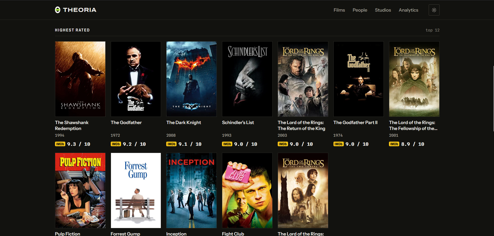
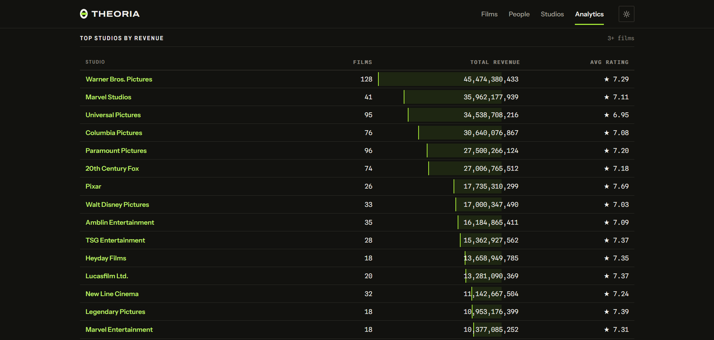
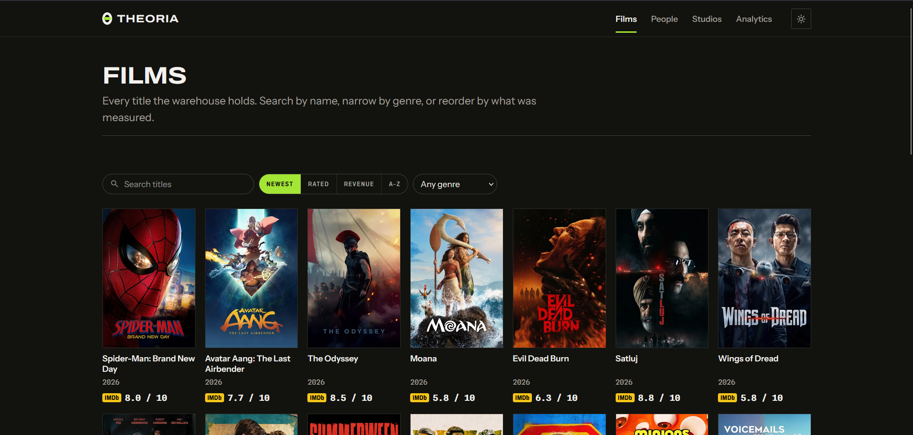
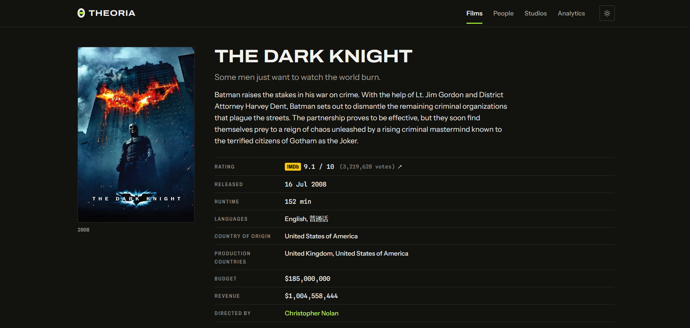

# Theoria

**A movie and TV analytics platform built on a real data engineering stack** — TMDB ingestion, a
three-layer S3 data lake, a dimensional PostgreSQL warehouse, and a Django front end that reads
it in English, Russian and Uzbek. Every layer is idempotent, quality-gated, and rebuildable from
immutable raw data.

```
TMDB API  →  Bronze (raw JSON)  →  Silver (typed Parquet)  →  Gold (aggregates)  →  PostgreSQL  →  Django
                        S3 data lake, partitioned by ingestion_date                  star schema
```

<sub>Python 3.12 · PostgreSQL (Neon) · AWS S3 · Django 5.1 · pandas · SQLAlchemy · pytest · GitHub Actions · Vercel</sub>

---

## The warehouse, as it stands

*Measured against the live warehouse on 2026-10-06; the nightly job moves these slowly.*

| | |
|---|---|
| Movies | **1,246** released 1971–2026 |
| TV shows | **740**, with **4,192** seasons and **85,298** episodes |
| People | **255,088** — everyone credited on a movie or a show, in every department, not just cast and directors |
| Credits | **245,189** on movies and **390,097** on shows, across 13 departments (860 distinct movie job titles) |
| Collections | **381** movie franchises, covering 617 movies |
| Ratings | IMDb for **1,242 / 1,246** movies, **737 / 740** shows, and **152,414** episodes; TMDB scores kept beside the movie ones |
| Trailers and clips | **18,230** for 1,224 movies, **2,363** for 648 shows |
| Warehouse tables | **34** — 14 dimensions, 6 facts, 8 bridges, 5 translation tables, 1 operational |
| Test suite | **845** tests |

The corpus is deliberate rather than incidental. TMDB's `movie/popular` endpoint returns whatever
is trending at call time, which produced a catalog that was 69% movies from the 2020s. Switching
extraction to `discover/movie`, windowed one release year at a time, rebuilt it as an even
~200 movies per decade (182–209 for the 1970s through the 2010s) — a time axis no downstream
transform could have recovered had the extraction step never collected it. A second, rolling
window adds movies from the last 120 days, which a per-year ranking by votes can't see yet, so the
2020s run higher (246). Shows are discovered the same way, one first-air year at a time.

## Screenshots

| Home | Analytics |
|---|---|
|  |  |

| Movie catalog | Movie detail |
|---|---|
|  |  |

---

## Architecture

### The three lake layers

| Layer | Format | Contract |
|---|---|---|
| **Bronze** | Raw JSON, one file per API response | Immutable and append-only. Never edited, never overwritten. It is the system of record every other layer can be rebuilt from. |
| **Silver** | Typed Parquet | Owns correctness — flattening, type casting, deduplication at the true grain. Bad rows are **quarantined**, never silently dropped. |
| **Gold** | Aggregated Parquet | Pre-computed analytical datasets (genre metrics, decade stats, filmography, director ratings), demonstrating the layer even though the Django views and analytics SQL recompute the same numbers live. |

Everything is partitioned by `ingestion_date=YYYY-MM-DD`. That single convention is what makes
re-runs idempotent and incremental loads possible: a partition is a unit of work that can be
reprocessed in isolation without touching anything else.

### The star schema

The movie side, with the TV side built as its structural mirror (`dim_series` in place of
`dim_movie`, its own credits, ratings and bridges, plus the season and episode grain below it):

```
        dim_genre   dim_date   dim_collection   dim_company   dim_country   dim_language
            │          │             │              │             │             │
            └────┬─────┘             │              ▼             ▼             ▼
                 ▼                   ▼      bridge_movie_company  bridge_movie_country
 dim_person ─► fact_credit ─► dim_movie ◄─ fact_movie_metrics    bridge_movie_language
      │                           ▲         (revenue, budget,             │
      │                           └── fact_movie_rating ◄────────────────┘
      │                               (imdb / tmdb — the rating of record)
      └─► fact_series_credit ─► dim_series ─► dim_season ─► dim_episode ─► fact_episode_rating
```

**Dimensions (14)** — movies: `dim_movie`, `dim_movie_video`; shows: `dim_series`, `dim_season`,
`dim_episode`, `dim_series_video`, `dim_network`; shared: `dim_person`, `dim_genre`,
`dim_collection`, `dim_date`, `dim_company`, `dim_country`, `dim_language`. A trailer table is a
multi-valued attribute of its title, so it is a `dim_`, loaded by *replace* rather than upsert (a
title's video set can shrink when TMDB drops one). Episodes are replaced per show for the same
reason.
**Facts (6)** — `fact_movie_metrics`, `fact_credit`, `fact_movie_rating`, `fact_series_credit`,
`fact_series_rating`, `fact_episode_rating`
**Bridges (8)** — `bridge_movie_{company,country,language}` and
`bridge_series_{genre,company,country,language,network}`. Factless join tables — no measure, just
the existence of a relationship — named `bridge_` rather than `fact_` to keep that distinction
visible in the schema itself. They are the warehouse's genuine many-to-many relationships: a
movie has 2.90 production companies on average and is produced in / spoken in several countries
and languages, unlike `dim_collection` (one collection per movie, so *that* relationship fits as a
plain column on `dim_movie`). `bridge_movie_country` carries `relation ∈ {origin, production}` in
its primary key, because the two disagree on 24% of movies that have both, and a coarser key would
let one overwrite the other.
**Translations (5)** — `movie_translation`, `series_translation`, `person_translation`,
`genre_translation`, `country_translation`; see *Three languages* below.
**Operational (1)** — `etl_watermarks`

Two tables were dropped once they proved dead weight, and the history is worth keeping:
`fact_collaboration` (derived in Gold, never read by any page) went on 2026-09-12 to reclaim space
on a free-tier database that was at 94% of its cap, and `person_alias` (a person's
`also_known_as` entries) went on 2026-09-23 as write-only. Silver still produces the aliases file.

Three grain decisions carry most of the weight:

- **`fact_credit` is keyed `(movie_id, person_id, department, job)`** — the grain TMDB actually
  publishes. A director who also wrote and produced is three credits, not one. Getting this wrong
  earlier in the project silently destroyed the "Director" row for 65 of 99 movies, because those
  people were usually credited as producers too and the dedup key couldn't tell the jobs apart.
  `fact_series_credit` is the same grain with the character added, since one actor can play
  several roles in a show.
- **`fact_movie_metrics` is keyed `(movie_id, date_id, genre_id)`**, so a multi-genre movie repeats
  its movie-level measures once per genre. Every query that aggregates `revenue` or `popularity`
  off it must collapse it with `SELECT DISTINCT movie_id, …` first. Ratings used to live here too
  and carried the same tax, so they moved to `fact_movie_rating`, keyed `(movie_id, source)` — one
  row per movie per source (IMDb from a daily bulk file, TMDB from the movie payload), so
  `AVG(rating)` needs no de-duplication and IMDb's mark is what the site shows.
- **Shows have an episode grain.** Season and episode rows come from one TMDB call per season, and
  episode ratings are joined in from IMDb's episode bulk file. A per-night cap
  (`TV_SEASONS_MAX_NEW`) bounds how many new shows get their episodes fetched, so a large backfill
  spreads over several nights instead of one long run; a finished show is fetched once, ever, and a
  running show again the night its episode count moves.

### Three languages

The interface ships in English, Russian and Uzbek, and so does the catalogue text — but the two
halves are built differently and have different coverage.

- **Interface strings** are ordinary Django `.po`/`.mo` catalogs (`django_app/locale/`). The
  compiled `.mo` files are committed, because a build without `msgfmt` would otherwise silently
  serve English. Russian and Uzbek interface text is a machine draft pending native review.
- **Catalogue text** comes from TMDB's per-language data, appended to calls the pipeline already
  makes (`append_to_response=translations`, so it costs no extra requests for movies, shows or
  people) and stored in five `*_translation` tables keyed `(entity id, lang)`. One row per
  language rather than a `title_ru` / `title_uz` column per language means a fourth language is a
  new value in `lang`, not an `ALTER TABLE`. Bronze trims each payload to the shipped languages as
  it is written (a full translations block is ~65 KB against a ~3 KB base payload), and the movie,
  show and person tables are replaced by parent id on load so a withdrawn translation disappears
  instead of lingering.
- **Reading it** goes through one module, `movies/i18n.py`. A movie or show's translated text is
  attached to the queryset as a correlated subquery that falls back to English, so search and
  sort run in SQL against the Russian title ("Начало" is findable, and Cyrillic titles sort in
  Cyrillic order) rather than relabelling a page after the fact. Genre and country names are small
  fixed vocabularies, loaded whole and mapped after the query, so the analytics SQL stays English.
  English is the source language and short-circuits every helper, so the English site runs exactly
  the queries it always did. URLs and slugs never translate.
- **The language is a cookie, not a URL prefix.** One URL serves every language; old `/ru/` and
  `/uz/` links redirect to the bare URL. `Accept-Language` is deliberately ignored, so a
  Russian-locale browser doesn't get the machine-drafted Russian unasked.

Coverage is honest rather than uniform. **Russian is real data**: titles for 97% of movies and
96.6% of shows, overviews for 97% of both. **Uzbek barely exists in TMDB**, so Uzbek is interface,
genre names (seeded by hand), country names, and the original title everywhere — film titles and
show names are kept for Russian only, because TMDB's Uzbek titles cover about 15% of movies and
5% of shows and a half-translated catalogue reads worse than an untranslated one. Where a reader's
language has no text, the English paragraph is shown, marked `lang="en"` with one quiet line saying
so. Seasons and episodes are not translated. Person biographies are translated only for the few
people whose details have been fetched with translations so far.

### Caching and staleness

The warehouse is small, nightly-updated and read-only, which makes caching it unusually safe: the
only thing that can make a cached value wrong is a new load, and the pipeline knows exactly when
that happens. So the site never *invalidates* anything.

- **A data version in every key.** After each committed load the pipeline publishes
  `theoria:data_version` to Redis. Every cache key the site builds embeds that value, so a new load
  makes every old key unreachable and they expire on their own. Cached: the home page's figures,
  poster mosaic and shelves, the analytics dashboard's result sets, the genre dropdowns and
  translated genre/country names, and a show's rendered episode list. After the load,
  `manage.py warm_cache` fills it, so the first visitor of the day doesn't wait for Neon to wake.
- **Sessions are read through the cache too** (`cached_db`): the database remains the source of
  truth and takes the writes, Redis serves the reads, and a flushed or unreachable Redis costs a
  database read rather than a sign-out.
- **Redis is an optimisation, never a dependency.** If it is unset, slow or down, the site computes
  from the warehouse exactly as it did before there was a cache. The language is part of every key
  that holds translated text, so one reader's Russian is never served to another. See
  `docs/architecture.md` §4.5.
- **Where the rest of the data lives.** In production the site runs in `fra1`, the same region as
  Neon, so an uncached query costs milliseconds. Locally, Django reads a Postgres replica of the
  warehouse, itself a read cache of Neon: it is rebuilt only when Neon's `ingestion_date` is newer
  (see *Local read replica*). `REDIS_URL` is left blank locally.
- **HTML is never reused blindly.** A page's navigation depends on who is signed in, so
  `PrivatePagesMiddleware` stamps `Cache-Control: private, no-cache` on every HTML response that
  doesn't choose its own policy: `private` keeps shared caches out, `no-cache` makes the browser
  revalidate on each navigation. The sign-in views use `no-store`. The cache holds data and
  fragments underneath the page, never a finished response.
- **One URL, three renderings.** Because language is a cookie, every response carries
  `Vary: Cookie` and a `Content-Language` header so no cache can hand one reader's language to
  another.
- **The back/forward cache ignores all of that.** A browser restoring a page on Back shows the
  snapshot it kept, not a fresh response. On `pageshow` the front-end script compares the
  snapshot's language and sign-in state with the current cookies and reloads on a mismatch (the
  language check carries a `sessionStorage` guard so blocked cookies can't cause a reload loop),
  and re-applies the saved theme in place.
- **Static assets are content-hashed.** In production `ManifestStaticFilesStorage` renames each
  file by its content, and Vercel serves them from its CDN. A changed stylesheet gets a new name,
  so it takes effect immediately and a returning visitor can't be stuck on an old copy.

### Data quality as a gate, not a report

Two check suites run as part of the pipeline, both exiting non-zero on failure:

- **`data_quality/silver_checks.py`** — schema, null, uniqueness and range checks per Silver
  entity. Offending rows are tagged with a `rejection_reason` and written to
  `data_quality/rejected/`, so a failure is investigable rather than just counted.
- **`data_quality/warehouse_checks.py`** — foreign-key anti-joins across every fact→dimension
  relationship, row-count reconciliation Bronze → Silver → Gold → warehouse, and a translation
  check: every `lang` in the five translation tables must be one the site ships, and a table
  must not be empty when its Silver file wasn't.

A lesson the project paid for: a check written by mirroring the transform's assumptions confirms
bugs instead of catching them. Check configs are now written from the source payload shape.

### Reading the warehouse from Django

Read-only access is enforced at three independent levels: a database router that refuses
migrations against the warehouse, `managed = False` on every model, and a separate database for
everything Django itself owns — accounts, sessions and each reader's saved collections (SQLite
locally, its own Neon database when deployed). The analytics dashboard executes the `.sql` files
in `warehouse/queries/` directly rather than re-expressing them through the ORM, so the queries
stay reviewable as SQL.

Full decision log, with the alternatives considered and the measurements behind each choice:
[`docs/architecture.md`](docs/architecture.md).

---

## Getting started

### Prerequisites

- Python 3.12 (what CI and development use)
- An S3 bucket for the data lake
- A PostgreSQL server with an empty database (e.g. `theoria`)
- A [TMDB API key](https://www.themoviedb.org/settings/api) (v3 auth)

### 1. Install and configure

```bash
python -m venv venv && source venv/bin/activate
pip install -r requirements-etl.txt   # superset: web runtime + pipeline + tests
cp .env.example .env              # fill in API key, AWS credentials, DATABASE_URL
python -c "import config"         # fails loud, listing every missing variable at once
python -c "import config; config.require_etl()"   # same, for the pipeline's own set
pytest                            # full suite; the ETL/data-quality tests need no network or
                                   # database, but the Django auth/view tests do run against
                                   # the real accounts database below (see step 4)
```

`config.py` is the only place that reads the environment. No script hardcodes a key, path or URL.

**Two requirements files, on purpose.** `requirements.txt` holds only what the web site runs on
(Django, psycopg2, python-dotenv, and the client for the optional in-page assistant);
`requirements-etl.txt` includes it and adds pandas, pyarrow, boto3, SQLAlchemy and pytest. The
hosted function installs the small one, so the ETL stack — an order of magnitude larger, and never
imported by a view — stays out of a bundle with a hard size limit. Locally you want
`requirements-etl.txt`.

Which variables are required depends on what you are running: `DATABASE_URL` always,
`DJANGO_SECRET_KEY` for the site, and `TMDB_API_KEY`/`AWS_*`/`S3_BUCKET` for the pipeline. A
missing one still stops the process before it does any work — it is just the right process now.

### 2. Create the warehouse schema

Apply the three bootstrap files in order against an empty database. Together they build the
**current** 34-table schema; all statements are `IF NOT EXISTS`, so re-running is safe.

```bash
psql "$DATABASE_URL_WITHOUT_DRIVER_PREFIX" -f warehouse/ddl/01_dimensions.sql
psql "$DATABASE_URL_WITHOUT_DRIVER_PREFIX" -f warehouse/ddl/02_facts.sql
psql "$DATABASE_URL_WITHOUT_DRIVER_PREFIX" -f warehouse/ddl/03_watermark.sql
```

> **Do not run `04`–`30` on a fresh database.** Those are the historical migrations that brought an
> already-live warehouse to this shape, and they are only correct applied in order to a database
> that predates them — `11_drop_legacy_person_tables.sql` drops tables `01` no longer creates, and
> `30_drop_uz_names.sql` cleans data a fresh database never had. Once a migration drops something,
> "run every DDL file in order" stops being the same instruction as "build the current schema".
> Use `04`–`30` only to migrate an existing Theoria warehouse.

`slug` columns are declared empty by the DDL and populated by `load_dimensions()`.

(`DATABASE_URL` uses SQLAlchemy's `postgresql+psycopg2://…` form; strip the `+psycopg2` suffix when
passing it to plain `psql`.)

### 3. Run the pipeline

```bash
python -m scripts.run_pipeline --source discover        # multi-decade catalog (recommended)
python -m scripts.run_pipeline --date 2026-07-06 --max-pages 5   # or today's popular list
```

For a given `ingestion_date`, this runs:

1. **Bronze** — the movie and TV genre lists, then movie discovery (`ingest_discover`, year-
   partitioned, plus the recent-releases window; or `ingest_movies`, paginated), then
   `ingest_movie_details` and `ingest_credits` for every discovered movie. The same stage then
   runs for TV: `ingest_discover_tv`, `ingest_series_details` (credits, external ids, videos and
   translations folded into one call per show) and `ingest_seasons` under the per-night cap.
   Daily IMDb bulk files supply movie, show and episode ratings, and company and person details
   are enriched for anyone not already fetched. Failures are logged per ID and returned for
   retry; completed work is never discarded.
2. **Silver** — a transform per entity for movies, shows, seasons and episodes, people, genres,
   companies, countries, languages, videos, ratings and translations, then `run_silver_checks` as a
   gate.
3. **Gold** — `build_gold_datasets` (genre metrics, decade stats, filmography, director ratings).
4. **Warehouse** — `load_dimensions`, `load_facts`, then `run_warehouse_checks`.

Every stage logs record counts and duration, and the run ends with a one-line summary. Re-running
the same date is safe: loads upsert via `ON CONFLICT DO UPDATE`.

To load only partitions newer than the recorded watermark:

```bash
python -m etl.warehouse_loader.load_dimensions --incremental
python -m etl.warehouse_loader.load_facts --incremental
```

The `DISCOVER_*` and `TV_DISCOVER_*` variables in `.env` are a **definition of the dataset**, not
tuning knobs — lowering `DISCOVER_MIN_VOTES` doesn't make the pipeline slower, it makes the
warehouse describe a different population.

### Keeping the catalog fresh

`run_pipeline.py` *discovers* titles — it can't refetch the ones already stored, so a title's
rating and vote count go stale the moment its partition is written. `run_refresh.py` is the
counterpart: it reads every `movie_id` from `dim_movie` and every `series_id` from `dim_series`,
refetches each title's TMDB details, credits, **trailer/clip metadata and translations** in **one**
call per title (`append_to_response`), plus today's IMDb ratings snapshots, fetches new seasons and
episodes for shows whose episode count moved, refreshes the translated genre and country names,
and then runs the same Silver → Gold → warehouse stages.

```bash
python -m scripts.run_refresh                 # refresh every movie and show in the warehouse for today
python -m etl.bronze.refresh_movies --movie-ids 550 551   # or just a few movies
python -m etl.bronze.refresh_series --series-ids 1396     # or just a few shows
```

Because every title is re-fetched nightly, anything a nightly adds to the payload — a new
translation, a new video — reaches the whole catalogue within a day without a separate backfill.

Before the warehouse load upserts `fact_movie_metrics` in place, `build_metrics_snapshot` appends
one row per movie (`rating`, `vote_count`, `revenue`, `popularity`) to
`gold/metrics_snapshot/ingestion_date=…/` — the lake keeps the history the warehouse overwrites.

Two GitHub Actions workflows run this unattended against a managed Postgres (Neon free tier) set
via the `DATABASE_URL` repo secret — no code change, every stage reads that one variable:
`nightly-refresh.yml` (`run_refresh` daily at 03:12 UTC) and `weekly-discovery.yml` (Mondays at
04:20 UTC, `run_pipeline --source discover` to add new titles and catch structural edits). Each
run appends a line to `ops/refresh-history.md`; that commit doubles as the activity that stops
GitHub disabling the schedules after 60 idle days. See `docs/architecture.md` for why the snapshot
is S3 and not a warehouse table, and why refresh is a separate orchestrator rather than a flag.

After the warehouse load, both workflows publish the cache data version (`python -m etl.data_version`
shows or, with `--bump`, republishes it) and run `manage.py warm_cache`. Both are best effort: a
Redis problem is logged and never fails a load.

### Local read replica

Neon lives in `eu-central-1`, so reading it directly from a laptop adds a ~90 ms round-trip to
every query — seconds per page. Instead, Django reads a **local Postgres copy**:

```bash
cd django_app && python manage.py serve      # syncs the replica if stale, then runserver
```

`serve` checks one date against Neon and does a full truncate-and-reload (about 1.2M rows) *only*
when the nightly job has produced a newer `ingestion_date` — a normal restart is instant. To run
the sync by itself (e.g. from cron): `python -m scripts.sync_warehouse_from_neon [--if-stale]`.

The sync lists its tables explicitly, so a table that exists locally but not yet on Neon fails the
sync. That is the reason schema changes go to Neon first (see *Hosting the site*).

Set `DATABASE_URL` to the local database and `NEON_DATABASE_URL` to the Neon endpoint (see
`.env.example`). The cloud pipeline is unaffected — it writes Neon directly. `docs/architecture.md`
§4.3 has the full rationale (including why `pg_dump` can't be used across the v16→v18
client/server gap).

### 4. Run the site

User accounts, email codes, sessions and collections live in their own durable database — never
in the ETL-owned warehouse. Locally this defaults to a SQLite file (no setup needed); apply
Django's migrations to it before first run:

```bash
cd django_app && python manage.py migrate     # accounts, core, auth, sessions, admin —
                                               # never `movies`/`analytics`
python manage.py runserver
```

Set `AUTH_DATABASE_URL` in `.env` (see `.env.example`) to point this at Postgres instead — required
once deployed, since Vercel's filesystem is ephemeral and would silently lose every account between
cold starts. A database that exists but was never migrated fails on the first request that touches
it (`django_session`, sign-up, sign-in); `manage.py serve` (see Local read replica above) checks
this and fails loud before starting the server rather than 500ing on the first page view.

| Route | What it serves |
|---|---|
| `/` | Catalog overview and the contact-sheet hero, mixing movies and shows |
| `/browse/` | Every movie and show in one searchable, sortable, paginated feed |
| `/movies/` · `/movies/<slug>/` | Search, sort and paginate the movies; per-movie detail with trailer, full cast and crew |
| `/tv/` · `/tv/<slug>/` | The same for shows, plus seasons, every episode with its IMDb rating, networks and trailer |
| `/cartoons/` | Animated movies and shows made for younger viewers, merged into one shelf |
| `/people/` · `/people/<slug>/` | Everyone holding any credit; per-person filmography across movies *and* shows, credits by department, and repeat collaborators |
| `/studios/` · `/studios/<slug>/` | Browsable studio index; per-studio provenance (description, headquarters, site, parent) above a filterable filmography |
| `/actors/` · `/directors/` | Scopes of `/people/`, filtered by the credits someone holds — not separate tables |
| `/analytics/` | Dashboard panels driven by the SQL in `warehouse/queries/`, for movies and shows |
| `/accounts/…` · `/me/` | Passwordless email-code sign-up and sign-in; a reader's Liked, Watch later and Top lists |
| `/assistant/…` | The in-page movie-guide chat (optional; needs `GEMINI_API_KEY`) |

Movies, shows and people are addressed by slug (`/people/tom-hanks/`), never by warehouse
surrogate key. Slugs are recomputed for the whole table on every load, with collisions numbered in
ascending id order — which is what makes them stable across re-runs rather than reassigned, and
across languages, since a slug is always built from the English name. Legacy `/actors/<slug>/` and
`/directors/<slug>/` URLs redirect to the unified person page, and `/ru/…` and `/uz/…` links
redirect to the bare URL.

### 5. Hosting the site

The site deploys to Vercel as a single Python function. Vercel finds `django_app/manage.py`,
reads `WSGI_APPLICATION` from settings, runs `collectstatic` during the build, and serves the
collected assets from its CDN. `vercel.json` carries the three settings that matter:

| Setting | Value | Why |
|---|---|---|
| `regions` | `fra1` | Frankfurt, the same region as the Neon warehouse. Left at the default `iad1` (US East), every query would cross the Atlantic and a page would cost seconds, not milliseconds — the very problem the local replica exists to solve. |
| `ignoreCommand` | a `git diff` over the paths the site actually serves | The nightly job commits a line to `ops/refresh-history.md` to keep its schedule alive. Vercel does **not** honour `[skip ci]`, so without this every nightly run would redeploy the site for a file no page reads. |
| `functions.excludeFiles` | tests, ETL, scripts, docs | Python bundles are not tree-shaken: everything reachable at build time ships. |

**Deployed data needs no deploy.** The nightly GitHub Actions job writes Neon; the site reads
Neon. New ratings and translations appear on the site once the job finishes, with no build and
nothing to clear: the cache keys roll over by themselves. `scripts/sync_warehouse_from_neon.py` and `manage.py serve` stay a *local*
concern — the hosted site is already co-located with the warehouse and reads it directly.

**Schema changes go the other way round.** Django never migrates the warehouse (every model is
`managed = False` and the router refuses migrations against it), so a new column or table means:
apply the `.sql` to Neon, run the loader, *then* deploy the code that reads it. Deploying first
means every visitor gets a 500 until the table exists. Preview deployments read the production
warehouse too — safe, since the site cannot write to it, but it does mean a preview of a new-table
feature stays broken until the DDL is applied.

Environment variables to set on the project: `DATABASE_URL` (the Neon **pooled** endpoint, the
warehouse), `AUTH_DATABASE_URL` (a *separate* Neon database for accounts/sessions — required here;
without it `settings.py` refuses to boot rather than silently point Django at Vercel's ephemeral
filesystem), `DJANGO_SECRET_KEY` (a fresh one — not the local development key), `EMAIL_HOST` +
`EMAIL_HOST_USER`/`EMAIL_HOST_PASSWORD`/`EMAIL_PORT`/`EMAIL_USE_TLS` (a real SMTP provider — sign-up
codes have nowhere to go without one) and `DEFAULT_FROM_EMAIL`, optionally `GEMINI_API_KEY` for the
assistant, optionally `DJANGO_ALLOWED_HOSTS` for a custom domain, and `REDIS_URL` (a `rediss://` URL
in the same region as the function; without it the site still works but caches per process only).
The GitHub Actions secret of the same name lets the nightly publish the data version and warm the cache. No TMDB or AWS credentials:
the site never calls either, and `config.py` no longer demands them of a process that doesn't.

Settings adapt on their own via the platform's own `VERCEL` variable — `DEBUG` is forced off,
`ALLOWED_HOSTS` picks up `.vercel.app` (so preview URLs work without being listed in advance),
secure cookies and the proxy SSL header switch on, the warehouse connection is held open across
requests, and `/admin/` is not routed at all rather than 500-ing on a public URL.

> Running locally with `DJANGO_DEBUG=False` requires `python manage.py collectstatic` first.
> Production uses `ManifestStaticFilesStorage`, which resolves every asset through a manifest
> that `collectstatic` writes — that is what makes a CSS change take effect immediately instead
> of waiting out a cached copy, and it fails loudly rather than serving a stale file.

---

## Testing

```bash
pytest
```

845 tests covering the ETL transforms, data quality checks, warehouse loaders, the translation
pipeline and the Django views, accounts and language handling. The suite mocks S3, TMDB and the
warehouse **at the boundary** — no live infrastructure, no network. Django views are driven through
their real URLs with the managers patched, so routing and template rendering are genuinely
exercised. Translation behaviour is tested at every hop (Bronze trimming, Silver picking, the
replace-on-load loader, the data-quality check, and the rendered Russian, Uzbek and fallback
pages).

## Project layout

```
etl/
  tmdb_client.py          retrying API wrapper
  s3_utils.py             the one place the S3 key convention is defined
  incremental.py          watermarks and partition discovery
  translations.py         which languages and fields the site keeps, shared by Bronze and Silver
  bronze/ silver/ gold/   one module per entity, per layer
  warehouse_loader/       upsert loaders for dimensions and facts
data_quality/             Silver and warehouse check suites; rejected/ holds quarantined rows
warehouse/
  db.py                   engine and session management
  ddl/                    01–03 bootstrap, 04–30 migrations
  queries/                analytics SQL — never inline in application code
django_app/
  theoria_site/           settings, URL routing
  core/                   language and caching middleware, warehouse router, saved collections
  movies/                 movies, shows, people, studios, and i18n.py (translated-text reads)
  analytics/              the dashboard
  accounts/               passwordless sign-up and sign-in
  assistant/              the optional in-page movie-guide chat
  locale/                 en/ru/uz interface catalogs (.mo files committed)
scripts/
  run_pipeline.py         end-to-end orchestration (discovery)
  run_refresh.py          refresh titles already in the warehouse
  sync_warehouse_from_neon.py  pull Neon → the local Postgres replica Django reads
.github/workflows/        nightly refresh + weekly discovery, on managed Postgres
ops/                      the run-history log the workflows append to, S3 lifecycle policy
tests/                    ETL, data quality, translation, account and view tests
docs/architecture.md      design decisions and their evidence
```

## Scope and non-goals

Theoria runs on one machine on purpose. There is no Spark, Kafka, Airflow, Snowflake, Lambda,
Terraform or Kubernetes, and adding them is explicitly out of scope. The goal is the *shape* of a
production analytics stack — layered storage, dimensional modelling, idempotent loads, quality
gates, incremental processing — at a scale where every stage can be read, run and debugged end to
end. The engineering decisions are documented as if the infrastructure were there; the
infrastructure isn't, and that is the trade being made.
